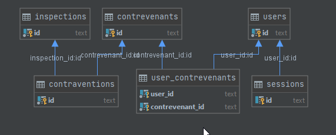

# INF5190-TP-FIN-SESSION  
## DESCRIPTION  
Le projet consiste à récupérer un ensemble de données provenant de la ville de Montréal et d'offrir des services à partir de ces données. Il s'agit de données ouvertes à propos d'établissements ayant reçu des constats d'infraction lors d'inspections alimentaires.  
  
## INSTALATION  
- Python 3.8 est la version utilisée dans ce projet
- S'assurer que ``pip`` est installé   
- Activer l'environent virtual **``py -m venv env``** et **``source env/bin/activate``** *(sous linux)* ou **``.\env\Scripts\activate``** *(sous windows)*  
- Lancer la commande **``pip install requirements.txt``** pour intaller les dépendances du projet.
- Lancer le programme a l'aide du fichier **`makefile`** à la racine du projet.

## FONCTIONNALITÉ
- **A1** : Un scripte `scripts\import_data_script.py` permettant de télécharger
la liste des contrevenants est obtenue en format XML à l'aide d'une requête HTTP et son contenu est stocké dans une base de données SQLite.
Un scripte `scripts\inf5190db.sql` est fourni pour la modélisation de cette base de données.

- **A2** : Un outil de recherche à la page d'accueil, qui permet de trouver les contrevenants par :
    - nom d’établissement;
    - propriétaire;
    - rue

- **A3** :  Un BackgroundScheduler dans l’application Flask afin d’extraire les données de la ville
de Montréal à chaque jour, à minuit, et mettre à jour les données de la base de données.

- **A4** :  Un service REST permettant d'obtenir la liste des contrevenants ayant commis une
infraction entre deux dates spécifiées en paramètre.
Une route `/doc` disponible et affiche la représentation HTML de la document RAML du
service web.

- **A5** :  Un petit formulaire de recherche rapide à la page d'acceuil permettant de saisir deux dates.

- **A6** : Amélioration du point A5 offrant un mode de recherche par nom du restaurant. L'application affiche l'information des
différentes infractions du restaurant.
